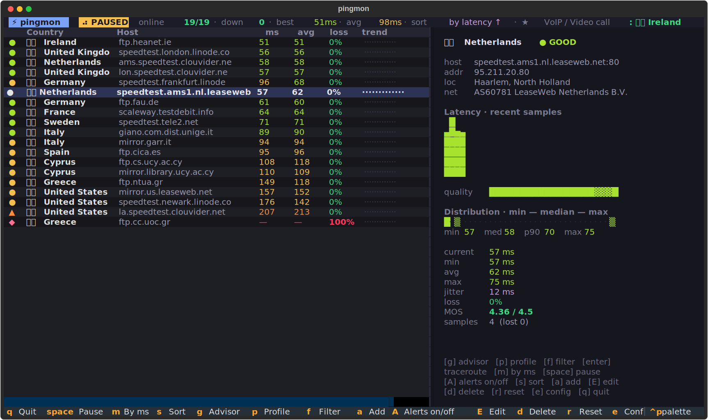
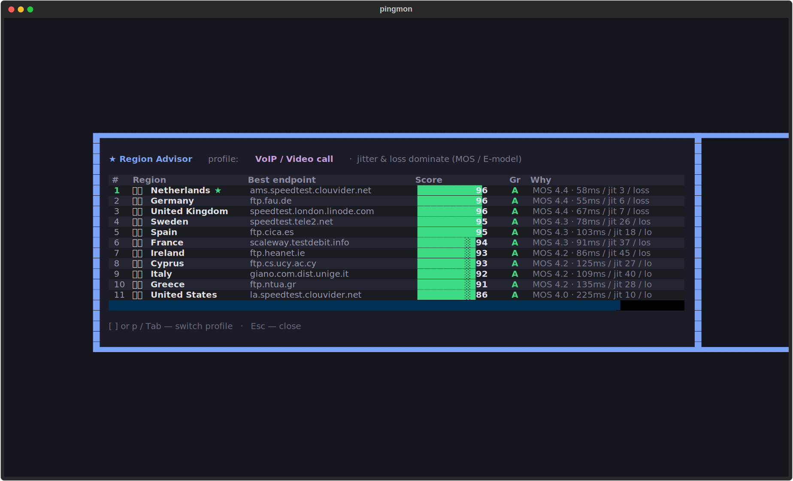
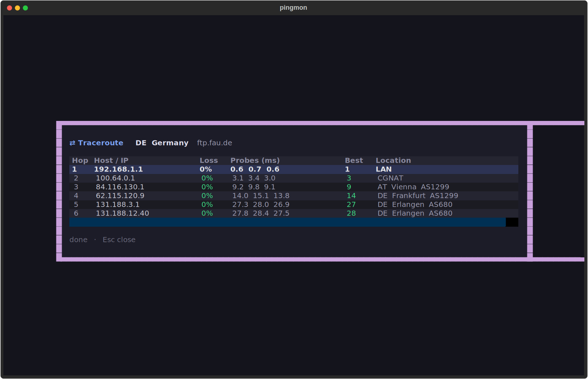

# pingmon

A full-featured terminal UI for monitoring **latency and availability** to
servers in different countries. Built with [Textual](https://textual.textualize.io/).

It continuously TCP-pings a set of targets (one or more reachable hosts per
country), and shows a live, colour-coded dashboard with per-target latency,
average, jitter, packet loss, a status indicator, and an animated trend graph.



## Features

- **Live dashboard** — sortable table of targets with status dot, latency, average, loss and an inline coloured sparkline trend.
- **Detail panel** — for the selected target: live latency graph, quality gauge, min / max / avg / jitter / loss, **MOS** call-quality score, resolved IP, **GeoIP city / region and the hosting network (ASN + ISP)**, sample count.
- **★ Region Advisor** *(unique)* — ranks regions by a composite 0–100 score under a chosen **use-case profile** (VoIP / Gaming / Web / Bulk) and highlights the best region to pick right now. Press `g`. See [below](#region-advisor).
- **MOS / R-factor** — turns latency + jitter + loss into the single VoIP call-quality number (ITU-T E-model), the same metric paid monitoring suites charge for.
- **Threshold alerts** — fire when a target stays slow or lossy for N samples: terminal bell, an in-app toast, an OS desktop notification, and a blinking row marker. Auto-clears on recovery.
- **Your own servers** *(new)* — mark a target with an SSH user and it becomes a server you can act on: press `Enter` to open a **live SSH shell** right inside the left panel (uses `ssh-agent` automatically, otherwise ssh prompts for the password in the panel), and `l` to run **`htop` / `atop` / `top`** live inside the right panel. Switch panels with `← / →`; leave a session with the tool's own `q` or `Ctrl-]`.
- **Honest availability for servers** *(new)* — a server isn't called UP just because the TCP edge answers (a box behind a DDoS scrubber still completes the handshake). For servers, availability is measured by reading the SSH banner, so a host you genuinely can't log in to reads **DOWN**.
- **Traceroute drill-down** — press `t` on a row for an mtr-style hop-by-hop path with per-hop loss and per-probe timings, plus **GeoIP per hop** (country code, city and ASN) so you can see which countries and networks the traffic crosses. For a server it probes with **TCP to the open port** (on macOS, and on Linux when run as root), which reaches hosts that drop the usual UDP/ICMP probes — the case where you can SSH in but a plain traceroute shows only `*`.
- **Per-country set, ready to go** — the Netherlands, Germany, United Kingdom, France, Cyprus, Italy, Spain, Greece, Sweden, Ireland and the United States are pre-configured with reachable hosts.
- **Editable targets** — add (`a`), edit (`E`) and delete (`d`) targets right inside the TUI, or edit the TOML config by hand; reset stats with `r`. In-app changes are saved to the config immediately.
- **GeoIP auto-detect & enrichment** — every target is looked up via ip-api.com: the detail panel shows its **city, region and hosting network (ASN + ISP)**, and when you add a target with country/code left blank they are filled in automatically.
- **Works in every terminal** — each country is shown as its **two-letter code** (`NL`, `DE`, `US`), not a flag emoji. Many terminals (iTerm2 among them) can't render regional-indicator flags and fall back to two boxed letters; the code is always legible.
- **Show filter** — flip the table between **all**, **mine only** (targets you added) and **others only** (the built-in set) with `f`.
- **No root required** — uses TCP connect timing (port 443/80), so it works without raw-socket / ICMP privileges and measures real service latency.
- **Modern terminal UX** — truecolor, mouse support, zebra-striped table, a live "heartbeat" spinner, keyboard and mouse navigation, sort modes and modal dialogs.

| Region Advisor | Traceroute drill-down |
| -------------- | --------------------- |
|  |  |

## Requirements

- Python 3.11+ (not needed for the standalone binary below)
- `textual >= 0.80` and `pyte >= 0.8` (installed automatically; `pyte` drives the
  embedded SSH / top terminals)
- A working `ssh` client on your `PATH` for the SSH login and remote-top features

## Install as a system command

Use it like `htop` — install once, run `pingmon` from anywhere.

### pipx / uv (recommended, Linux + macOS)

```bash
pipx install pingmonitor                 # from PyPI
pipx install .                           # or from a checkout of this repo
pipx install git+https://github.com/kottot13/pingmon
# uv works the same:  uv tool install pingmonitor   /   uvx --from pingmonitor pingmon
```

The PyPI package is **`pingmonitor`**; it installs the **`pingmon`** command.
`pipx` keeps it in its own isolated environment and puts `pingmon` on your
`PATH`. Then just run `pingmon`.

### Homebrew (macOS / Linuxbrew)

A formula skeleton lives in [`packaging/pingmon.rb`](packaging/pingmon.rb).
Publish to PyPI, fill in the sdist URL + `brew update-python-resources`, then:

```bash
brew install kottot13/tap/pingmon
```

### Standalone binary (no Python on the target)

The most htop-like option — a single executable built with PyInstaller
([`packaging/pingmon.spec`](packaging/pingmon.spec)):

```bash
pip install pyinstaller
pyinstaller packaging/pingmon.spec
sudo cp dist/pingmon /usr/local/bin/     # macOS
cp dist/pingmon ~/.local/bin/            # Linux
```

Build once per OS/architecture (PyInstaller does not cross-compile).

### From source (development)

```bash
./run.sh                # makes a local venv, installs Textual, launches
# or
python3 -m venv .venv && .venv/bin/pip install -e . && .venv/bin/pingmon
```

Config lives at `~/.config/pingmon/config.toml` by default (or a local
`./config.toml` if present, or `$PINGMON_CONFIG`). Run `pingmon --help` for the
CLI flags (`-V/--version`, `-c/--config PATH`).

## Keys

| Key            | Action                          |
| -------------- | ------------------------------- |
| `↑ / ↓`, `j/k` | Move selection (or scroll the focused panel) |
| `← / →`        | Switch focus between the left (table) and right (detail) panel |
| `Enter`        | SSH login to the selected server, live in the left panel (asks for user/port the first time) |
| `l`            | Remote diagnostics menu (top, load causes, logins, SSH log, connections, kernel log, traffic, disk — plus your own tools), live in the right panel |
| `t`            | Traceroute drill-down for the selected target |
| `Ctrl-]`       | Exit a live SSH / top console back to the dashboard — always works, even mid-session (a hint bar under the console reminds you). htop/atop/top also quit on their own `q` |
| `g`            | Open the Region Advisor (`[` `]` / `p` switch profile inside) |
| `p`            | Cycle the Advisor profile (VoIP / Gaming / Web / Bulk) |
| `f`            | Cycle the show filter (all / mine only / others only) |
| `space`        | Pause / resume probing          |
| `m` / `M`      | Sort by latency (ms); press again to flip fastest ⇄ slowest first |
| `s`            | Cycle sort (country / latency / loss / jitter) |
| `a`            | Add a target                    |
| `E`            | Edit the selected target (form pre-filled) |
| `A`            | Toggle the alert system on / off |
| `d`            | Delete the selected target      |
| `r`            | Reset all statistics            |
| `e`            | Show the config file path       |
| `q`            | Quit                            |

## Your own servers (SSH)

Give a target an **SSH user** and pingmon treats it as *your server*. The quick
way: just press `Enter` on any target — if it has no SSH user yet, a small dialog
asks for the user and SSH port (default `22`), saves them on the target and
connects. You can also set it ahead of time in the add/edit form (`a` / `E`) or
as `ssh_user` in the config. Once a target is a server:

- **Availability is honest.** Instead of trusting a bare TCP handshake, pingmon
  reads the SSH banner. A server that only answers SYN/ACK at the network edge
  (typical under a DDoS) but whose `sshd` can't respond reads **DOWN**, not a
  false UP. For a server, the `port` field is the **SSH port** (usually `22`).
- **`Enter` logs in.** A live SSH shell opens inside the left panel. If
  `ssh-agent` holds a key the login is automatic; otherwise ssh prompts for the
  password right there in the panel (nothing is stored, no `sshpass` needed).
- **Load summary at a glance.** Select a server and the detail panel shows a
  live **Server load** block — load average vs. core count (flagged
  `overloaded`), the top processes by CPU and by memory, tasks stuck in disk
  wait, root-filesystem usage and memory used. It answers *why* a box is busy
  without logging in. (Needs ssh-agent or a key; refreshed every few seconds.)
- **`l` opens a remote diagnostics menu.** A scrollable list (↑/↓, Enter) of
  ready-made checks that run over SSH in the right panel:
  - **top** — the always-present process monitor. Want `htop`, `btop`, `iotop`,
    `ncdu`, `glances`…? Use **＋ Run a tool…** at the bottom: type its name and
    pick **Install & run** — if it's missing pingmon installs it via the server's
    package manager first (`apt`/`dnf`/`yum`/`apk`/`pacman`/`zypper`; sudo is
    asked in the console). Tools you add **stay in the menu** for next time.
  - **Load average — why is it high** — `uptime`, `vmstat` (run-queue & iowait),
    `free`, top processes by CPU and memory, `iostat` if present.
  - **Logins & intrusion** — `w`, `last`, failed logins (`lastb`).
  - **SSH auth log** — accepted and brute-force attempts, failed passwords by
    source IP (`journalctl`/`auth.log`).
  - **Connections & ports** — listening and established sockets (`ss`/`netstat`).
  - **Kernel & system log** — `dmesg` and journal warnings.
  - **Live network traffic** — `iftop`/`nethogs`/`nload` if installed, else live
    interface counters.
  - **Interface stats** and **Disk & I/O** — `ip -s link`, `df`, `lsblk`, biggest
    directories.

  Every entry sticks to tools shipped on almost every Linux and degrades
  gracefully when a fancier one is missing. The choice is remembered per server.
- **Getting around.** `← / →` move focus between the two panels **at any time —
  even while a console is live**, so you can keep an SSH shell open on the left
  and `htop` running on the right and hop between them. (Arrows switch panels and
  aren't sent to the remote; `↑ / ↓` still go to it, so shell history and htop
  navigation work.) Quit a remote tool with its own `q`; from a shell use
  `logout` / `Ctrl-D`. `Ctrl-]` exits the focused console back to the dashboard.

The embedded terminals are real VT terminals (rendered with `pyte`), so
full-screen tools, colours and function keys work.

## Region Advisor

The Advisor (`g`) answers the question the tool was born from — *which region
should I actually pick right now?* It computes a **0–100 score** per region from
latency, jitter and loss, under a selectable **profile**:

| Profile | What it optimises for |
| ------- | --------------------- |
| **VoIP / Video call** | jitter & loss dominate; driven by the MOS / E-model score |
| **Gaming** | raw latency + jitter, loss punished hard |
| **Web / API** | latency-led, mild loss penalty |
| **Bulk / Backup** | loss-led, tolerant of high latency |

Regions are ranked best-first with the #1 pick highlighted, each with a score
bar, a letter grade (A–F) and a one-line reason. Switch profile with `[` / `]`,
`p` or `Tab`; close with `Esc`.

## Alerts

A target enters **alert** state when, for `alert_window` consecutive samples, it
is unreachable, slower than `alert_latency` ms, or its recent loss exceeds
`alert_loss` %. On entry pingmon rings the terminal bell, shows a toast, raises
an OS desktop notification (macOS `osascript` / Linux `notify-send`, toggle with
`desktop_notify`) and blinks the row's status marker; it auto-clears with a
"Recovered" toast. Press `A` to switch the whole alert system off or on at any
time (the banner shows `⚲ alerts off` while disabled); tune or permanently
disable the triggers in `config.toml`.

## Status colours

| Status      | Meaning (last sample)         |
| ----------- | ----------------------------- |
| `EXCELLENT` | < 40 ms                       |
| `GOOD`      | < 90 ms                       |
| `FAIR`      | < 180 ms                      |
| `POOR`      | < 350 ms / ≥ 350 ms           |
| `UNSTABLE`  | loss ≥ 20% or a recent drop   |
| `DOWN`      | 3+ consecutive failures       |
| `PENDING`   | no samples yet                |

## Configuration

On first run a `config.toml` is created at `~/.config/pingmon/config.toml` (or
wherever `$PINGMON_CONFIG` / `--config` points). The location does **not** depend
on your current directory, so targets you add in-app are always reloaded from the
same file no matter where you launch `pingmon`. It is plain TOML and meant to be
hand-edited:

```toml
interval = 2.0        # poll period per target, seconds
timeout  = 2.0        # TCP connect timeout, seconds
history  = 90         # samples kept in memory for the graph

alert_latency = 300.0 # alert if latency stays above this (ms); 0 disables
alert_loss    = 20.0  # alert if recent loss exceeds this (%); 0 disables
alert_window  = 3     # consecutive bad samples before an alert fires
desktop_notify = true # also raise an OS desktop notification on alert

[[targets]]
country = "Netherlands"
flag = "🇳🇱"
host = "speedtest.ams1.nl.leaseweb.net"
port = 80
source = "builtin"   # "builtin" (shipped) or "user" (added in-app) — drives the `f` filter

[[targets]]
country = "United States"
flag = "🇺🇸"
host = "speedtest.newark.linode.com"
port = 443
source = "builtin"

[[targets]]
country = "My VPS"
flag = "🏳"
host = "203.0.113.10"  # your server's IP or hostname (this is a documentation IP)
port = 22              # SSH port — servers are probed by reading the SSH banner
source = "user"
ssh_user = "root"     # set this to make it a server: Enter logs in, l = tools
top_tool = "htop"     # remembered choice for l (optional)
```

Add as many `[[targets]]` blocks as you like; any host or IP works, and the
port is per-target. `source` is optional — if omitted it is inferred (hosts in
the built-in set are `builtin`, everything else `user`). `flag` is optional too:
the UI shows the two-letter country code derived from it, so you can leave it out
and let GeoIP fill it in. When adding a target in-app, the country field accepts a
plain code like `PL`.

## How latency is measured

`pingmon` opens a TCP connection to `host:port` and times the round-trip of the
connection handshake (SYN → SYN/ACK). That is close to true network RTT and,
unlike ICMP, needs no elevated privileges and reflects whether the service port
is actually answering. Failed or timed-out connects count as packet loss.

**Servers** (targets with an `ssh_user`) go one step further: after connecting
to the SSH port they wait for the SSH banner and time the round-trip to the
*first byte the server sends*. A handshake that completes but never produces a
banner — a dead `sshd`, or a scrubbing layer answering on the server's behalf —
is counted as a failure, so availability reflects whether you can really reach
the box, not just its network edge.

## Project layout

```
pingmon/
  app.py      # Textual app: table, detail panel, graphs, advisor, alerts, SSH actions
  pinger.py   # async TCP ping (connect + SSH-banner probe) + DNS resolve
  stats.py    # rolling per-target stats (latency, jitter, loss, MOS, status)
  scoring.py  # Region Advisor: composite score + use-case profiles
  netutil.py  # async traceroute, GeoIP, desktop notify, SSH helpers
  terminal.py # embedded live terminal widget (pty + pyte) for SSH / top panels
  render.py   # colours, status meta, text sparklines
  config.py   # TOML load/save + built-in per-country target set
  app.tcss    # dark theme / layout
```
